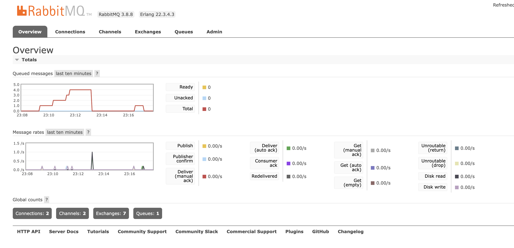

## My MicroServices
### Nest.js + RabbitMQ + PostgreSQL + MongoDB

#### How to run
- install docker on your machine
- clone this repository
- run `docker-compose up`
- make a request follow the postman collection file

#### Architecture

#### RabbitMQ

